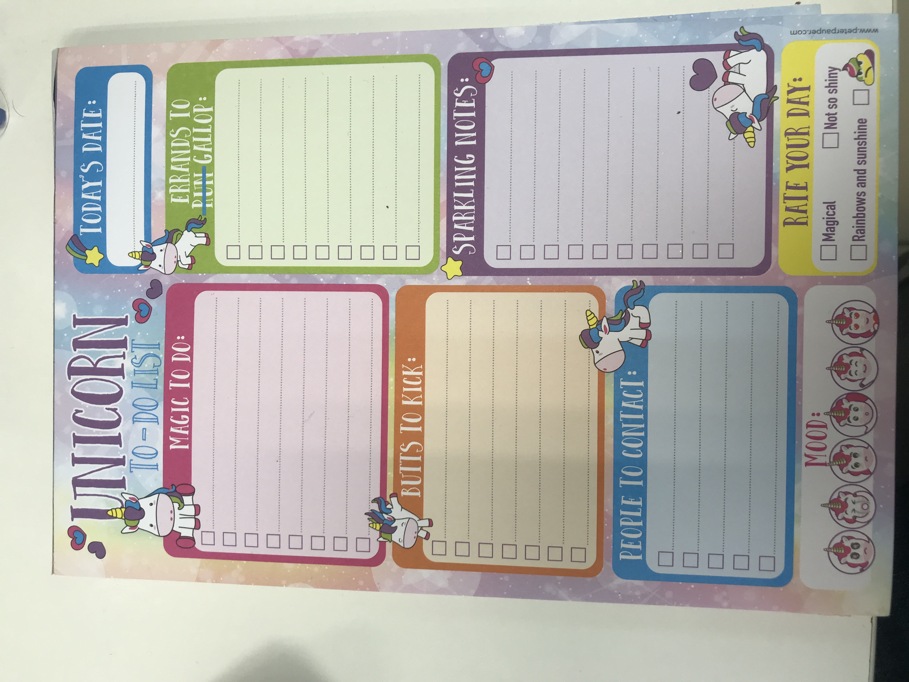

# Mixed Message To-Do list Project.
<!--Table of contents--->
## Table of contents
<!--- list down---->
1. About The Project
    1. About Me
    2. Project
2. Technology
3. Example Objective

---
<!--- About Project and Me--->
## About The Project
### About Me 
Hello World I' am a self taught programmer situated on an Island in Malaysia where their aren't many programers I can reach out too. I have been teaching myself how to program through Codecademy and from following the Course. I have now landed on the Task of doing a "Mixed-Message" generator. Though the task may sound simple I would like to amp it up by incorporating HTML and CSS as well as incorporate some of things I have learnt about using Git and Github. Thus here I am asking the world if there is anybody who would rescue a poor soul stranded. ;D

---
### Project
I have provided an image of an already on hand "To-Do list" that I would like to imitate **below** part of this file. I figured why not try to imitate something that already exist on hand through ***learn by imitation***.  

---
<!--- Put Image here--->

***Sample document to replicate.***

---

Ultimately there are three parts I would like this program to do for now. More complexity would be added added later down the line.

#### First 

* Getting user inputs for each section of the list and pushing it to an array identified by the section. 

#### Second 

* Have a button that would generate a report to display on another page.

#### Third 

* Have it randomly suggest which task to choose to do.

---
<!--- Technology --->
## Technology
<!--- list down---->
1. HTML
2. CSS
3. Javascript
4. Node JS

---
## Example Objective.
<!--- Put Image here--->
<!--- Descripton--->

---

